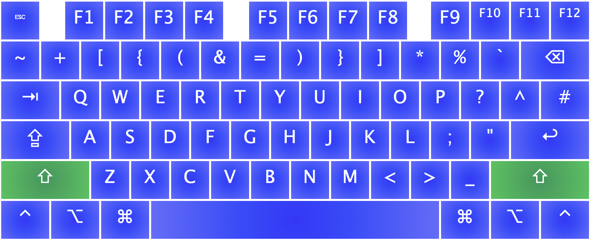

# QWERTY Custom Symbols

This is my custom keyboard layout. It is based on [ThePrimeagen's DVORAK version.](https://github.com/ThePrimeagen/keyboards)
For now this is a test, I'm gonna export this to Windows and test how it goes. It works pretty well on MacOS.

It is recommended to log out/restart after adding the keyboard layout.

## Keyboard Layout Preview

Base layer Inverted:


Shift layer Inverted:


## Why 2 versions of the same layout?

The `Inverted` version just works better for some things like playing video games. Also there is something weird with AH in Windows, keybinds kinda work with the `Base` one but sometimes I need to swap to the `Inverted` one to get it to work again idk. 

### MacOS

Made using [Ukelele](https://software.sil.org/ukelele/).

```
sudo cp ./QWERTY_custom_symbols_base.keylayout /Library/Keyboard\ Layouts
sudo cp ./QWERTY_custom_symbols_inverted.keylayout /Library/Keyboard\ Layouts
```

### Windows

Made using [MSKLC](https://www.microsoft.com/en-us/download/details.aspx?id=102134)

Go to -> Project -> Build -> Install layout

### Linux

WIP
